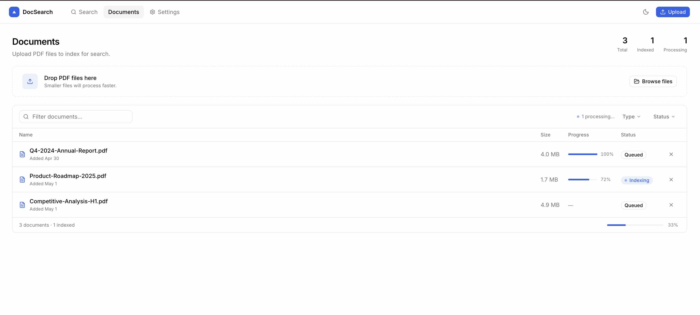

# Document search
A simple web application to index and search documents.

## Implemented features
1. Document upload

## Pending features
1. Document search
1. Reading files from backend

## Screenshots


## Getting Started
Create a .env file and add the following keys:
```txt
NEXT_PUBLIC_BACKEND_DOMAIN="http://localhost:8000"
```
This should be set to the domain of the backend.  

First, run the development server:

```bash
npm run dev
# or
yarn dev
# or
pnpm dev
# or
bun dev
```
Open [http://localhost:3000](http://localhost:3000) with your browser to see the result.  
This is a [Next.js](https://nextjs.org) project bootstrapped with [`create-next-app`](https://nextjs.org/docs/app/api-reference/cli/create-next-app).
